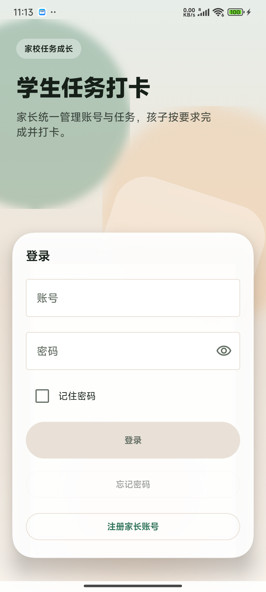
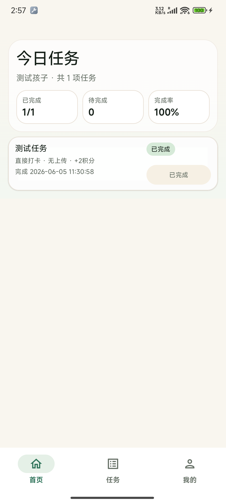
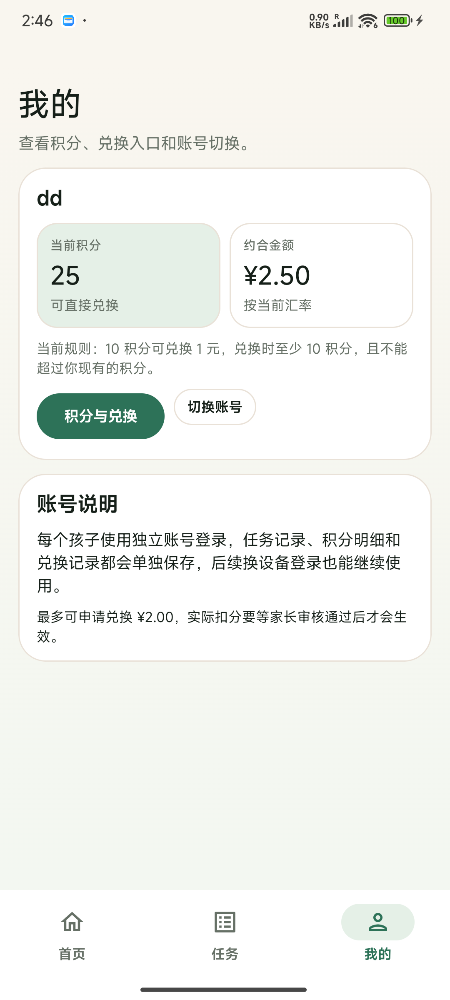
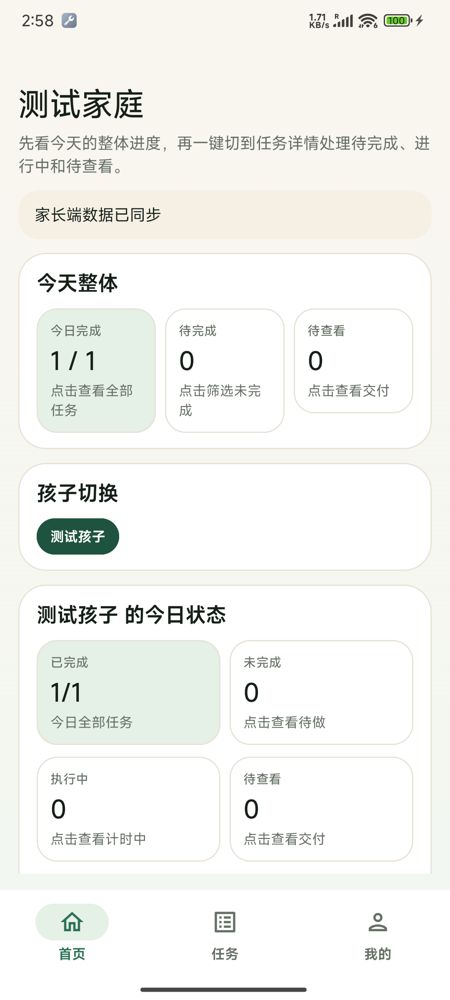
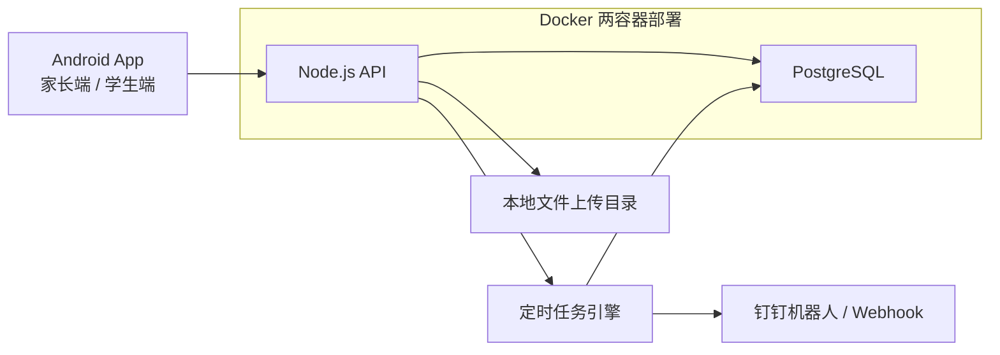

# StudentClockin

一个面向家庭场景的学生任务打卡系统，支持家长统一管理多个孩子的任务、积分、兑换和完成记录，也适合后续继续二开、开源和自部署。

## 项目亮点

- 一个家庭可管理多个孩子，每个孩子使用独立账号
- 任务可按孩子分别分配，互不串数据
- 支持直接打卡、倒计时、正计时三种任务模式
- 支持交付条件：无要求 / 照片 / 视频 / 音频
- 完成任务自动发放积分，孩子可主动申请积分兑换
- 家长可查看今日、最近 7 天、最近 30 天等完成统计
- 支持 Docker 自部署，适合家用服务器和二开团队
- 预留钉钉机器人 / Webhook 通知能力

## 界面预览

| 登录页 | 学生首页 |
| --- | --- |
|  |  |

| 学生积分页 | 家长总览页 |
| --- | --- |
|  |  |

以上截图来自当前项目的真实 Android 调试版本，用于展示当前 UI 方向与核心流程。

## 适用场景

- 自己给孩子做日常任务打卡和奖励管理
- 一个家庭多个孩子独立管理任务
- 需要把数据放到自己的服务器长期保存
- 想基于现有代码继续做功能扩展和开源发布

## 仓库结构

实际项目代码位于 `student-checkin/` 目录：

- `student-checkin/android-app/`
  - Android 客户端，Kotlin + Jetpack Compose
- `student-checkin/backend/`
  - Node.js API 服务
- `student-checkin/supabase/migrations/`
  - PostgreSQL 数据库迁移脚本
- `student-checkin/deploy/`
  - Docker / 家用服务器部署辅助文件
- `student-checkin/docs/`
  - 开发、部署、接口、运维说明

## 架构图



## 核心功能

### 家长端

- 注册家庭账号、管理家庭名称
- 新增孩子账号、重置密码、停用或删除账号
- 按孩子新增任务、编辑任务、删除任务
- 设置任务模式、积分值、交付条件、排序和展示信息
- 查看每个孩子当天任务完成情况和状态分布
- 审核孩子积分兑换申请
- 查看积分变动、任务完成和兑换统计

### 学生端

- 使用独立账号登录
- 查看当天属于自己的任务列表
- 执行直接打卡 / 倒计时 / 正计时任务
- 按任务要求上传照片 / 视频 / 音频
- 查看自己的积分、折算金额和兑换规则
- 发起积分兑换申请
- 切换账号，适合同一设备多个孩子轮流使用

### 后端能力

- 北京时间 `00:00:00` 自动生成每日任务实例
- 保存每个孩子每天每个任务的完成状态和精确时间
- 保存积分流水、兑换记录、任务用时和交付记录
- 提供统计汇总接口，支持家长端查看趋势
- 支持自部署和通过反向代理对外提供服务

## 快速开始

### 1. 拉取仓库

```bash
git clone https://github.com/runi898/StudentClockin.git
cd StudentClockin/student-checkin
```

### 2. 启动后端

```bash
cp .env.example .env
```

至少修改：

- `POSTGRES_PASSWORD`
- `JWT_SECRET`
- `API_PORT`

启动：

```bash
docker compose up -d --build
```

### 3. 配置 Android 连接你的后端

```bash
cp android-app/gradle-local.example.properties android-app/gradle-local.properties
```

修改为你自己的服务地址：

```properties
studentclockinSupabaseUrl=http://your-server:28547
studentclockinSupabasePublicKey=student-checkin-public
```

说明：

- `studentclockinSupabaseUrl` 填你的 API 地址
- `studentclockinSupabasePublicKey` 当前只需要非空占位值
- Android 构建层暂时沿用旧字段名，便于兼容已有代码

### 4. 编译 APK

Windows PowerShell：

```powershell
.\scripts\build-debug-apk.ps1
```

或手动编译：

```powershell
cd android-app
.\gradlew.bat assembleDebug
```

## 部署方式

当前后端为精简的 2 容器方案：

1. `student-checkin-postgres`
2. `student-checkin-api`

不需要完整 Supabase 容器组，维护更简单，更适合家用服务器和轻量部署。

## 重要文档

- [项目说明](./student-checkin/README.md)
- [开发环境搭建](./student-checkin/docs/developer-setup.md)
- [家用服务器 Docker 部署](./student-checkin/docs/home-server-docker.md)
- [部署说明](./student-checkin/docs/deployment.md)
- [接口契约](./student-checkin/docs/api-contract.md)
- [运维说明](./student-checkin/docs/operations.md)

## 隐私与公开仓库说明

这份源码已经按公开仓库方式整理：

- 不包含你的内网 IP
- 不包含你的个人测试域名
- 不包含你的 SSH 密码
- 不包含固定数据库密码或 JWT 密钥

其他开发者拿到仓库后，只需要填写自己的：

- 后端地址
- 数据库密码
- JWT 密钥
- 反向代理 / 域名配置

## 推荐下一步

如果你要继续把它打磨成正式开源项目，建议下一步再补这几项：

1. GitHub Releases 打包说明
2. 数据备份与恢复文档
3. APK 安装截图或录屏 GIF
4. 功能 Roadmap 和已知限制说明
